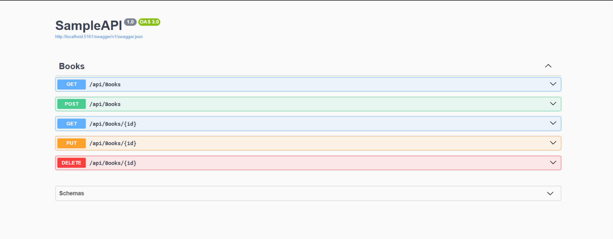
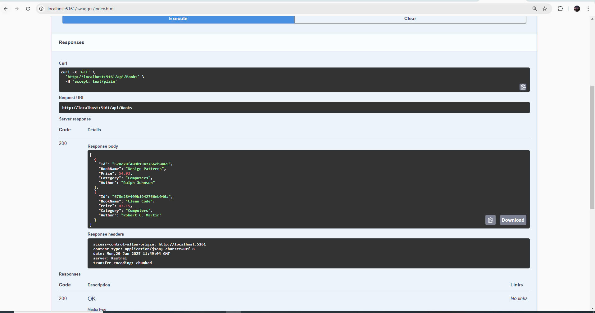

# Mô Tả Kết Quả Đạt Được

## Tổng Quan
Dự án này triển khai một API sử dụng ASP.NET Core để quản lý một cửa hàng sách, kết nối với cơ sở dữ liệu MongoDB. Dưới đây là các chức năng và mô tả kết quả đạt được:

### 1. **Khởi tạo và cấu hình dự án**
   - **Program.cs** cấu hình các dịch vụ và pipeline cho ứng dụng.
   - Kết nối MongoDB được thiết lập thông qua `BookStoreDatabaseSettings` từ `appsettings.json`.
   - Swagger được cấu hình cho môi trường phát triển để dễ dàng kiểm tra và thử nghiệm các API.

### 2. **Dịch vụ BooksService**
   - **BooksService.cs** là lớp chứa các phương thức để tương tác với cơ sở dữ liệu MongoDB.
   - Các phương thức của dịch vụ bao gồm:
     - `GetAsync()`: Trả về danh sách tất cả các cuốn sách.
     - `GetAsync(string id)`: Trả về cuốn sách theo `id`.
     - `CreateAsync(Book newBook)`: Thêm một cuốn sách mới vào cơ sở dữ liệu.
     - `UpdateAsync(string id, Book updatedBook)`: Cập nhật thông tin một cuốn sách.
     - `RemoveAsync(string id)`: Xóa một cuốn sách theo `id`.

### 3. **Controller**
   - **BooksController.cs** cung cấp các endpoint cho API để quản lý sách, bao gồm các phương thức HTTP.

| HTTP Method | Endpoint                      | Mô tả                                      |
|-------------|-------------------------------|--------------------------------------------|
| GET         | `/api/books`                  | Lấy tất cả các cuốn sách.                 |
| GET         | `/api/books/{id}`             | Lấy thông tin chi tiết của cuốn sách theo `id`. Nếu không tìm thấy sách, trả về mã lỗi 404. |
| POST        | `/api/books`                  | Tạo một cuốn sách mới. Trả về mã 201 (Created) khi sách được thêm thành công. |
| PUT         | `/api/books/{id}`             | Cập nhật thông tin cuốn sách nếu tồn tại. Nếu không tìm thấy sách, trả về mã lỗi 404. |
| DELETE      | `/api/books/{id}`             | Xóa cuốn sách khỏi cơ sở dữ liệu nếu tồn tại. Nếu không tìm thấy sách, trả về mã lỗi 404. |

## Kết Quả
- **API Hoạt Động Mượt Mà**: Tất cả các endpoint API đều hoạt động như mong đợi, cho phép quản lý sách từ cơ sở dữ liệu MongoDB thông qua các phương thức GET, POST, PUT, DELETE.

- **Tương Tác MongoDB**: Ứng dụng đã kết nối thành công với MongoDB, thực hiện các thao tác CRUD (Create, Read, Update, Delete) trên bộ sưu tập sách.
- **Tài Liệu API**: Swagger UI được cấu hình cho phép người dùng dễ dàng thử nghiệm các API trực tiếp từ trình duyệt, giúp việc kiểm tra và phát triển trở nên thuận tiện hơn.
